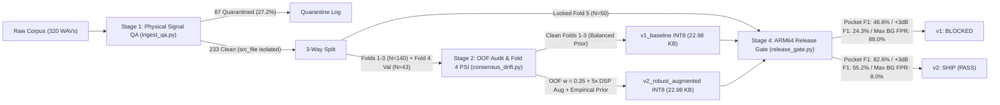

# PixelSense-Lite: Edge-Audio ML Data Pipeline & ARM64 INT8 Release Gate

[](https://github.com/coryjacoblewis/pixelsense-lite/actions/workflows/arm64_ml_release_gate.yml)
[](https://netron.app/?url=https://raw.githubusercontent.com/coryjacoblewis/pixelsense-lite/main/models/v2_robust_augmented/model_int8.tflite)

## Overview

**PixelSense-Lite** is an audio data QA, spectral shift auditing, `.tflite` INT8 quantization, and ARM64 release-gating pipeline for 5-class audio classification (`coughing`, `snoring`, `siren`, `crying_baby`, `background_noise`) on a 320-clip [ESC-50](https://github.com/karolpiczak/ESC-50) subset partitioned into source-isolated (`src_file`) **Folds 1–3** (Train, `N=140`), **Fold 4** (Val/Shift Audit, `N=43`), and **Fold 5** (Locked Test, `N=50` across 42 sources).

| Stage | Module | Responsibility |
| :---: | :--- | :--- |
| **1** | [`ingest_qa.py`](./ingest_qa.py) | Screens WAVs for category-agnostic physical defects: multi-sample clipping saturation, DC offset, and excessive dead air (`233 PASS`, `87 QUARANTINE`). |
| **2** | [`consensus_drift.py`](./consensus_drift.py) | Folds 1–3 OOF RF classifier-to-label disagreement down-weighting (`w = 0.35`) and Fold 4 orthogonal spectral PSI auditing across natural cross-fold and synthetic stress slices. |
| **3** | [`train_quantize.py`](./train_quantize.py) | Trains 2D CNN under natural empirical vs. balanced class priors and exports `fp32`, `fp16`, and `int8` `.tflite` models. |
| **4** | [`release_gate.py`](./release_gate.py) | Enforces `.tflite` binary/tensor/arena bounds (`<= 45 KB` file, `<= 160 KB` tensors, `<= 512 KB` `AllocateTensors` heap), INT8 operator compliance, SHA-256-verified ARM64 XNNPACK latency (`p95 <= 1.0 ms`), and Fold 5 + 5-seed INT8 F1 / BG FPR gates. |

> **Docs:** [Audio Corpus & Signal QA SOP (`docs/data_collection_sop.md`)](./docs/data_collection_sop.md) | [Model & Data Cards (`docs/model_and_data_cards.md`)](./docs/model_and_data_cards.md) | [Release Gate Scorecard (`reports/04_release_gate_scorecard.md`)](./reports/04_release_gate_scorecard.md)



---

## Release Gate Scorecard (`v1_baseline` vs. `v2_robust_augmented` on Locked Fold 5)

| Release Candidate | Quant | Binary (<=45 KB) | Subgraph Tensors (<=160 KB) | Peak Op I/O (<=100 KB) | Non-INT Tensors (0) | INT Tensor % (100%) | Host p99 (<=5.0 ms) | Clean F1 (>=65%) | Pocket F1 (>=58%) | +3dB Noise F1 (>=52%) | Pooled BG FPR (<=15%) | Max Slice BG FPR (<=15%) | Gate Status |
| :--- | :---: | :---: | :---: | :---: | :---: | :---: | :---: | :---: | :---: | :---: | :---: | :---: | :--- |
| `v1_baseline` | `fp32` | 64.08 KB | 587.94 KB | 320.00 KB | 20 | 4.8% | 0.331 ms | 79.49% | 46.62% | 24.33% | 36.00% | 88.00% | BLOCKED (HW + SLICE) |
| `v1_baseline` | `fp16` | 36.04 KB | 617.76 KB | 320.00 KB | 30 | 3.2% | 0.310 ms | 79.49% | 46.62% | 24.33% | 36.00% | 88.00% | BLOCKED (HW + SLICE) |
| `v1_baseline` | `int8` | 22.98 KB | 147.33 KB | 80.00 KB | 0 | 100.0% | 0.120 ms | 80.69% | 46.62% | 24.33% | 34.67% | 88.00% | BLOCKED (SLICE F1) |
| `v2_robust_augmented` | `fp32` | 64.08 KB | 587.94 KB | 320.00 KB | 20 | 4.8% | 0.310 ms | 90.35% | 82.62% | 55.21% | 2.67% | 4.00% | BLOCKED (HW) |
| `v2_robust_augmented` | `fp16` | 36.04 KB | 617.76 KB | 320.00 KB | 30 | 3.2% | 0.317 ms | 90.35% | 82.62% | 55.21% | 2.67% | 4.00% | BLOCKED (HW) |
| **`v2_robust_augmented`** | **`int8`** | **22.98 KB** | **147.33 KB** | **80.00 KB** | **0** | **100.0%** | **0.123 ms** | **86.70%** | **82.62%** | **55.21%** | **4.00%** | **8.00%** | **SHIP (PASS)** |

### Paired Source-Clustered Bootstrap 95% CIs & Per-Slice BG FPR (Fold 5: N = 50 across 42 `src_file` sources, 1,000 Replicates)

| Locked Fold 5 Slice | `v1_baseline` INT8 (95% CI) | `v2_robust_augmented` INT8 (95% CI) | Paired ΔF1 (`v2 - v1`) | Paired ΔF1 95% Bootstrap CI | `v1` BG FPR | `v2` BG FPR |
| :--- | :---: | :---: | :---: | :---: | :---: | :---: |
| `clean` (Reference Audio) | 80.69% `[68.80%, 92.87%]` | 86.70% `[74.42%, 96.37%]` | `+6.01%` | `[-12.59%, +21.35%]` | 12.00% | **8.00%** |
| `pocket_occluded` (1,600 Hz LP) | 46.62% `[33.46%, 74.41%]` | 82.62% `[72.76%, 96.34%]` | **`+36.00%`** | **`[+14.64%, +48.58%]`** | 88.00% | **0.00%** |
| `appliance_noise_3db` (+3 dB SNR) | 24.33% `[14.05%, 32.45%]` | 55.21% `[43.58%, 68.05%]` | **`+30.88%`** | **`[+18.40%, +45.15%]`** | 4.00% | **4.00%** |

### Multi-Seed 2x2 Factorial Ablation ([`reports/03_training_and_ablation_metrics.csv`](./reports/03_training_and_ablation_metrics.csv))

| Configuration (Trained on Folds 1–3) | Views / Epochs | Sample Weights & Class Prior | Seed-42 Val Mean F1 (Val Max BG FPR) | Seed-42 FP32 Test Clean / Pocket / +3dB (Mean) | Seed-42 INT8 Test Clean / Pocket / +3dB (Mean) | Seed-42 Test Max BG FPR (FP32 / INT8) | 5-Seed INT8 Test F1 Mean ± Std | 5-Seed INT8 Test Max BG FPR Mean ± Std |
| :--- | :---: | :---: | :---: | :---: | :---: | :---: | :---: | :---: |
| 1. `v1_baseline` (Clean Only) | 140 / 70 | `w=1.00`, Balanced 1/K | 48.82% (`84.21%`) | 79.49% / 46.62% / 24.33% (`50.15%`) | 80.69% / 46.62% / 24.33% (`50.55%`) | 88.00% / 88.00% | `47.53 ± 1.75%` | `96.80 ± 4.66%` |
| 2. `step_matched_clean` (5x Steps) | 140 / 350 | `w=1.00`, Balanced 1/K | 58.81% (`21.05%`) | 92.04% / 59.14% / 33.76% (`61.65%`) | 92.04% / 59.14% / 28.78% (`59.99%`) | 20.00% / 20.00% | `57.66 ± 5.80%` | `45.60 ± 32.46%` |
| 3. `v2_augmentation_only` | 700 / 70 | `w=1.00`, Balanced 1/K | 72.92% (`36.84%`) | 79.56% / 86.08% / 75.83% (`80.49%`) | 76.82% / 86.94% / 76.77% (`80.18%`) | 36.00% / 36.00% | `77.03 ± 3.50%` | `27.20 ± 9.60%` |
| 4. `v2_aug_oof_weights_only` | 700 / 70 | `w=0.35`, Balanced 1/K | 74.08% (`26.32%`) | 78.13% / 89.38% / 73.15% (`80.22%`) | 78.13% / 89.38% / 70.40% (`79.30%`) | 32.00% / 32.00% | `77.75 ± 1.97%` | `25.60 ± 9.67%` |
| 5. `v2_aug_empirical_prior_only` | 700 / 70 | `w=1.00`, Empirical Prior | 78.76% (`10.53%`) | 91.44% / 86.07% / 56.86% (`78.12%`) | 91.44% / 83.03% / 54.08% (`76.18%`) | 12.00% / 12.00% | `76.13 ± 0.89%` | `11.20 ± 5.31%` |
| 6. **`v2_robust_augmented`** | 700 / 70 | **`w=0.35` + Empirical Prior** | **71.75% (`15.79%`)** | **90.35% / 82.62% / 55.21% (`76.06%`)** | **86.70% / 82.62% / 55.21% (`74.84%`)** | **4.00% / 8.00%** | **`76.81 ± 2.46%`** | **`13.60 ± 8.62%`** |

---

## Pipeline Stage Telemetry

### Stage 1: Physical Signal QA ([`reports/01_signal_qa_report.csv`](./reports/01_signal_qa_report.csv))

| QA Gate Status | Clips | Share | Criterion |
| :--- | :---: | :---: | :--- |
| `PASS` | 233 | 72.8% | Clean signal (Folds 1–3: 140, Fold 4: 43, Fold 5: 50; includes 2 single-sample peak-normalized clips) |
| `QUARANTINE_CLIPPING_SATURATION` | 75 | 23.4% | Peak amplitude >= 0.998 with > 2 saturated samples (`MULTI_SAMPLE_SATURATION`) |
| `QUARANTINE_DC_OFFSET` | 10 | 3.1% | Mean signal drift > 0.002 |
| `QUARANTINE_EXCESSIVE_DEAD_AIR` | 2 | 0.6% | < 12% active 50ms frames above -50 dBFS |

### Stage 2A: Folds 1–3 OOF Classifier-to-Label Audit ([`reports/02_oof_label_noise_audit.csv`](./reports/02_oof_label_noise_audit.csv))

88.6% OOF RF classifier-to-label agreement (124/140 clips), κ = 0.822 (`StratifiedGroupKFold` by `src_file` strictly on Folds 1–3 `train_pool`; automated label-noise probe against single-label ESC-50 metadata):

| Disputed Training Clip | Split Role (`src_file`) | ESC-50 Label | OOF RF Pred (Conf) | Sample Action & Training Treatment |
| :--- | :---: | :---: | :---: | :--- |
| `1-187207-A-20.wav` | Fold 1 Train (187207) | `crying_baby` | `coughing` (0.656) | `DOWNWEIGHT_NOISY_LABEL` (`w = 0.35` in `v2`) |
| `2-43802-A-42.wav` | Fold 2 Train (43802) | `siren` | `background_noise` (0.780) | `DOWNWEIGHT_NOISY_LABEL` (`w = 0.35` in `v2`) |
| `3-124795-A-28.wav` | Fold 3 Train (124795) | `snoring` | `background_noise` (0.692) | `DOWNWEIGHT_NOISY_LABEL` (`w = 0.35` in `v2`) |
| `3-51731-A-42.wav` | Fold 3 Train (51731) | `siren` | `background_noise` (0.776) | `DOWNWEIGHT_NOISY_LABEL` (`w = 0.35` in `v2`) |

### Stage 2B: Fold 4 Cross-Fold Stability & Synthetic Stress-Slice PSI ([`reports/02_psi_spectral_drift_audit.csv`](./reports/02_psi_spectral_drift_audit.csv))

| Validation Slice (Fold 4 vs. Folds 1–3) | Val Clips | High-Freq Band PSI (`>2.0 kHz`) | Passband Dynamic-Range PSI (`<1.5 kHz`) | Composite PSI | Threshold | Shift Status |
| :--- | :---: | :---: | :---: | :---: | :---: | :--- |
| `clean` (Natural Cross-Fold Audio) | 43 | 0.0494 | 0.0272 | 0.0494 | 0.2500 | `STABLE` |
| `pocket_occluded` (Synthetic 1,600 Hz LP) | 43 | **2.0071** | **0.0263** | 2.0071 | 0.2500 | `HIGH_SHIFT_AUGMENTATION_ACTIVE` |
| `appliance_noise_3db` (Synthetic +3 dB SNR) | 43 | 1.9135 | **0.6300** | 1.9135 | 0.2500 | `HIGH_SHIFT_AUGMENTATION_ACTIVE` |

### Stage 4: Linux `aarch64` C++ Operator Telemetry ([`reports/05_arm64_op_profile_int8.csv`](./reports/05_arm64_op_profile_int8.csv), [`reports/05_arm64_hardware_telemetry_int8.txt`](./reports/05_arm64_hardware_telemetry_int8.txt))

```mermaid
flowchart LR
    IN["int8[1,64,64,1]"] --> C1["CONV_2D 16x3x3 (72.0 µs)"]
    C1 -->|"int8[1,64,64,16]"| P1["MAX_POOL_2D (6.0 µs)"]
    P1 -->|"int8[1,32,32,16]"| C2["CONV_2D 32x3x3 (61.0 µs)"]
    C2 -->|"int8[1,32,32,32]"| P2["MAX_POOL_2D (2.0 µs)"]
    P2 -->|"int8[1,16,16,32]"| C3["CONV_2D 32x3x3 (25.0 µs)"]
    C3 -->|"int8[1,16,16,32]"| GAP["MEAN GlobalAvgPool (< 0.10 µs)"]
    GAP -->|"int8[1,32]"| FC["2x FULLY_CONNECTED + SOFTMAX (< 0.20 µs)"]
    FC --> OUT["int8[1,5]"]
```



| Subgraph Operator (`v2 INT8`) | Op Count | Raw ARM64 CPU (`--use_xnnpack=false`) | ARM64 XNNPACK Delegate (`--use_xnnpack=true`) | Speedup & Kernel Dispatch |
| :--- | :---: | :---: | :---: | :--- |
| `conv1` (`CONV_2D` 16x3x3) | 1 | 93.97 µs (31.4%) | 72.00 µs (43.4%) | 1.31x (`Convolution NHWC, QC8 IGEMM`) |
| `pool1` (`MAX_POOL_2D` 2x2) | 1 | 11.00 µs (3.7%) | 6.00 µs (3.6%) | 1.83x (`Max Pooling NHWC, S8`) |
| `conv2` (`CONV_2D` 32x3x3) | 1 | 80.08 µs (26.8%) | 61.00 µs (36.7%) | 1.31x (`Convolution NHWC, QC8 IGEMM`) |
| `pool2` (`MAX_POOL_2D` 2x2) | 1 | 3.40 µs (1.1%) | 2.00 µs (1.2%) | 1.70x (`Max Pooling NHWC, S8`) |
| `conv3` (`CONV_2D` 32x3x3) | 1 | 33.80 µs (11.3%) | 25.00 µs (15.1%) | 1.35x (`Convolution NHWC, QC8 IGEMM`) |
| `gap` (`MEAN` GlobalAvgPool) | 1 | 75.87 µs (25.4%) | < 0.10 µs (0.0%) | >100x (`Mean ND SIMD reduction`) |
| `fc1` + `probs` (`FULLY_CONNECTED` + `SOFTMAX`) | 3 | 0.78 µs (0.3%) | < 0.20 µs (0.1%) | ~4.0x (`Fully Connected NC, QS8, QC8W GEMM`) |
| **Total Inference (avg / p95)** | **9 Nodes** | **300.97 µs / 310 µs** | **172.38 µs / 177 µs** | **1.75x Faster (42.7% latency reduction)** |
| **Init `AllocateTensors` (Process RSS Delta)** | **Session Init** | **256.0 KB** (`3.27 MB` process RSS delta) | **512.0 KB** (`4.15 MB` process RSS delta) | **SHA-256-verified `benchmark_model` profile** |

---

## Quickstart

```bash
python3.11 -m venv .venv
source .venv/bin/activate
pip install -r requirements.txt

python release_gate.py --require-arm64-telemetry  # Fast gate check on cached slices & .tflite (<3s)
pytest test_pipeline.py                           # Unit & integration test suite (<3s)
python run_automated_pipeline.py                  # Full rebuild (QA, Fold 4 PSI, 5-seed ablations, gate)
```
