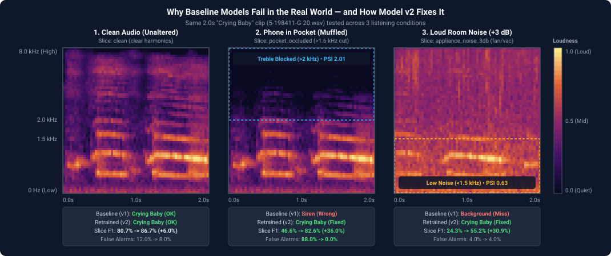
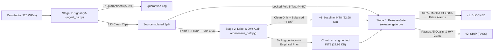

# PixelSense-Lite: Edge-Audio ML Pipeline & ARM64 INT8 Release Gate

[](https://github.com/coryjacoblewis/pixelsense-lite/actions/workflows/arm64_ml_release_gate.yml)
[](https://netron.app/?url=https://raw.githubusercontent.com/coryjacoblewis/pixelsense-lite/main/models/v2_robust_augmented/model_int8.tflite)

**PixelSense-Lite** is an end-to-end edge-audio ML pipeline that trains, quantizes, and release-gates a **23 KB 8-bit integer (`INT8`) `.tflite` model** for 5-class sound recognition (`coughing`, `snoring`, `siren`, `crying_baby`, `background_noise`) on ARM64 processors.

## The Problem & Result

Models trained only on clean studio audio (`v1_baseline`) fail in real-world conditions—such as when a phone is muffled inside a pocket or placed near a loud appliance—and trigger false alarms up to **88%** of the time on everyday background noise. PixelSense-Lite (`v2_robust_augmented`) fixes this without increasing model size or latency:



| Metric (Locked Fold 5 Test Set, `INT8` `.tflite`) | `v1_baseline` (Clean Train) | `v2_robust_augmented` (Ours) | Improvement | Release Requirement |
| :--- | :---: | :---: | :---: | :---: |
| **Clean Audio Accuracy (Macro F1)** | 80.69% | **86.70%** | `+6.01%` | `>= 65.0%` |
| **Pocket-Muffled Accuracy (Macro F1)** (1,600 Hz low-pass) | 46.62% | **82.62%** | **`+36.00%`** | `>= 58.0%` |
| **Noisy Room Accuracy (Macro F1)** (+3 dB appliance noise) | 24.33% | **55.21%** | **`+30.88%`** | `>= 52.0%` |
| **False-Alarm Rate on Background Noise (Max BG FPR)** | 88.00% | **8.00%** | **`-80.00%`** | `<= 15.0%` |
| **Model Binary Size / ARM64 Latency (p95)** | 22.98 KB / — | **22.98 KB / 177 µs** | Same footprint | `<= 45 KB` / `<= 1.0 ms` |
| **Release Gate Verdict** | **BLOCKED** | **SHIP (PASS)** | — | All gates passed |

---

## Quickstart

```bash
python3.11 -m venv .venv
source .venv/bin/activate
pip install -r requirements.txt

python run_automated_pipeline.py                  # Run full pipeline (Stages 1-4: QA, drift audit, training, gate)
python release_gate.py --require-arm64-telemetry  # Re-run Stage 4 release gate + SHA-256 ARM64 telemetry check
pytest test_pipeline.py                           # Run unit & integration test suite
```

---

## How the 4-Stage Pipeline Works

Using a 320-clip subset of [ESC-50](https://github.com/karolpiczak/ESC-50), the pipeline enforces strict source-recording isolation (`src_file`) across **Folds 1–3** (Train, `N=140`), **Fold 4** (Validation & Shift Audit, `N=43`), and **Fold 5** (Locked Test, `N=50` across 42 sources) so clips cut from the same original Freesound recording never appear in both training and test sets (zero data leakage):



| Stage | Script | What It Does | Output Artifact |
| :---: | :--- | :--- | :--- |
| **1. Signal QA** | [`ingest_qa.py`](./ingest_qa.py) | Screens raw WAV files for physical audio defects (clipping saturation, DC offset, dead air). Quarantines 87 bad clips; passes 233 clean clips. | [`reports/01_signal_qa_report.csv`](./reports/01_signal_qa_report.csv) |
| **2. Drift & Label Audit** | [`consensus_drift.py`](./consensus_drift.py) | Flags and down-weights likely mislabeled training clips (`w = 0.35`), and measures frequency drift (PSI) on Fold 4 to trigger 5x audio augmentation. | [`reports/02_oof_label_noise_audit.csv`](./reports/02_oof_label_noise_audit.csv), [`reports/02_psi_spectral_drift_audit.csv`](./reports/02_psi_spectral_drift_audit.csv) |
| **3. Train & Quantize** | [`train_quantize.py`](./train_quantize.py) | Trains a compact 2D CNN on 64x64 Log-Mel spectrograms and exports `fp32`, `fp16`, and 8-bit integer (`int8`) `.tflite` models across 5 random seeds. | [`reports/03_training_and_ablation_metrics.csv`](./reports/03_training_and_ablation_metrics.csv) |
| **4. Release Gate** | [`release_gate.py`](./release_gate.py) | Audits `.tflite` memory/operators, verifies SHA-256 ARM64 XNNPACK speed, and blocks any candidate failing Fold 5 accuracy or false-alarm limits. | [`reports/04_release_gate_scorecard.md`](./reports/04_release_gate_scorecard.md) |

> **Reference Docs:** [Audio Corpus & Signal QA SOP (`docs/data_collection_sop.md`)](./docs/data_collection_sop.md) | [Model & Data Cards (`docs/model_and_data_cards.md`)](./docs/model_and_data_cards.md)

---

## Stage-by-Stage Results

### Stage 1: Physical Audio QA ([`reports/01_signal_qa_report.csv`](./reports/01_signal_qa_report.csv))

| QA Gate Status | Clips | Share | Rejection Rule |
| :--- | :---: | :---: | :--- |
| `PASS` | 233 | 72.8% | Clean signal (140 Train, 43 Val, 50 Test; preserves single-sample peak-normalized files) |
| `QUARANTINE_CLIPPING_SATURATION` | 75 | 23.4% | Peak amplitude `>= 0.998` across `> 2` samples (`MULTI_SAMPLE_SATURATION`) |
| `QUARANTINE_DC_OFFSET` | 10 | 3.1% | Mean waveform offset `> 0.002` |
| `QUARANTINE_EXCESSIVE_DEAD_AIR` | 2 | 0.6% | `< 12%` active 50ms frames above `-50 dBFS` |

### Stage 2: Mislabeled-Clip Detection & Acoustic Drift Audit

- **Catching Mislabeled Training Clips ([`reports/02_oof_label_noise_audit.csv`](./reports/02_oof_label_noise_audit.csv)):** Cross-validation (`StratifiedGroupKFold` by `src_file`, κ = `0.822`, `88.6%` agreement) flags 4 training clips where the audio conflicts with the ESC-50 label (`1-187207-A-20.wav`, `2-43802-A-42.wav`, `3-124795-A-28.wav`, `3-51731-A-42.wav`) and lowers their training weight (`w = 0.35`) so noisy labels do not corrupt the model.
- **Detecting Muffled & Noisy Audio Drift ([`reports/02_psi_spectral_drift_audit.csv`](./reports/02_psi_spectral_drift_audit.csv)):** Measures how much pocket muffling or appliance noise shifts the audio spectrum compared to clean training audio using Population Stability Index (`PSI`). Because both stress slices exceed the `0.25` drift threshold, the pipeline automatically enables 5x audio augmentation:

| Fold 4 Validation Slice | Clips | High-Freq PSI (`>2.0 kHz`) | Passband Dynamic-Range PSI (`<1.5 kHz`) | Max PSI | Threshold | Action |
| :--- | :---: | :---: | :---: | :---: | :---: | :--- |
| `clean` (Natural Cross-Fold Audio) | 43 | 0.0494 | 0.0272 | 0.0494 | 0.2500 | `STABLE` |
| `pocket_occluded` (1,600 Hz Low-Pass) | 43 | **2.0071** | 0.0263 | 2.0071 | 0.2500 | `HIGH_SHIFT_AUGMENTATION_ACTIVE` |
| `appliance_noise_3db` (+3 dB SNR Noise) | 43 | 1.9135 | **0.6300** | 1.9135 | 0.2500 | `HIGH_SHIFT_AUGMENTATION_ACTIVE` |

### Stage 3: Ablation Study — Why `v2_robust_augmented` Works ([`reports/03_training_and_ablation_metrics.csv`](./reports/03_training_and_ablation_metrics.csv))

Because over half of the training corpus is background noise (`53.6%`), standard equal-class weighting (`Balanced 1/K`) causes the model to over-predict rare target events and triggers **25%–97% false-alarm rates** (`BG FPR`). Training on the **natural class mix (`Empirical Prior`)** with **5x audio augmentation** and **noisy-label down-weighting (`w=0.35`)** cuts false alarms to **`8.0%`** (`13.6%` mean across 5 independent training seeds):

| Configuration (Trained on Folds 1–3) | Train Views / Epochs | Weighting & Prior | Seed-42 INT8 Clean / Pocket / +3dB F1 (Mean) | Seed-42 INT8 Max BG FPR | 5-Seed INT8 Mean F1 ± Std | 5-Seed INT8 Max BG FPR ± Std |
| :--- | :---: | :---: | :---: | :---: | :---: | :---: |
| 1. `v1_baseline` (Clean Only) | 140 / 70 | `w=1.00`, Balanced 1/K | 80.69% / 46.62% / 24.33% (`50.55%`) | 88.00% | `47.53 ± 1.75%` | `96.80 ± 4.66%` |
| 2. `step_matched_clean` (5x Epochs) | 140 / 350 | `w=1.00`, Balanced 1/K | 92.04% / 59.14% / 28.78% (`59.99%`) | 20.00% | `57.66 ± 5.80%` | `45.60 ± 32.46%` |
| 3. `v2_augmentation_only` | 700 / 70 | `w=1.00`, Balanced 1/K | 76.82% / 86.94% / 76.77% (`80.18%`) | 36.00% | `77.03 ± 3.50%` | `27.20 ± 9.60%` |
| 4. `v2_aug_oof_weights_only` | 700 / 70 | `w=0.35`, Balanced 1/K | 78.13% / 89.38% / 70.40% (`79.30%`) | 32.00% | `77.75 ± 1.97%` | `25.60 ± 9.67%` |
| 5. `v2_aug_empirical_prior_only` | 700 / 70 | `w=1.00`, Empirical Prior | 91.44% / 83.03% / 54.08% (`76.18%`) | 12.00% | `76.13 ± 0.89%` | `11.20 ± 5.31%` |
| 6. **`v2_robust_augmented`** | 700 / 70 | **`w=0.35` + Empirical Prior** | **86.70% / 82.62% / 55.21% (`74.84%`)** | **8.00%** | **`76.81 ± 2.46%`** | **`13.60 ± 8.62%`** |

### Stage 4: Full Release Gate Scorecard & Hardware Telemetry ([`reports/04_release_gate_scorecard.md`](./reports/04_release_gate_scorecard.md))

#### 1. `.tflite` Quantization & Memory Gate

Quantizing from 32-bit float (`fp32`) to 8-bit integer (`int8`) shrinks the model binary by **2.8x** (`64.08 KB -> 22.98 KB`) and subgraph tensor RAM by **4.0x** (`587.94 KB -> 147.33 KB`), making `v2_robust_augmented` (`int8`) the only build that passes all hardware and accuracy gates:

| Candidate | Quant | Binary (`<=45 KB`) | Subgraph Tensors (`<=160 KB`) | Peak Op I/O (`<=100 KB`) | INT Tensors (`100%`) | Host p99 (`<=5.0 ms`) | Clean / Pocket / +3dB F1 | Pooled / Max BG FPR (`<=15%`) | Gate Status |
| :--- | :---: | :---: | :---: | :---: | :---: | :---: | :---: | :---: | :--- |
| `v1_baseline` | `fp32` | 64.08 KB | 587.94 KB | 320.00 KB | 4.8% | 0.331 ms | 79.49% / 46.62% / 24.33% | 36.00% / 88.00% | BLOCKED (HW + SLICE) |
| `v1_baseline` | `fp16` | 36.04 KB | 617.76 KB | 320.00 KB | 3.2% | 0.310 ms | 79.49% / 46.62% / 24.33% | 36.00% / 88.00% | BLOCKED (HW + SLICE) |
| `v1_baseline` | `int8` | 22.98 KB | 147.33 KB | 80.00 KB | 100.0% | 0.120 ms | 80.69% / 46.62% / 24.33% | 34.67% / 88.00% | BLOCKED (SLICE F1) |
| `v2_robust_augmented` | `fp32` | 64.08 KB | 587.94 KB | 320.00 KB | 4.8% | 0.310 ms | 90.35% / 82.62% / 55.21% | 2.67% / 4.00% | BLOCKED (HW) |
| `v2_robust_augmented` | `fp16` | 36.04 KB | 617.76 KB | 320.00 KB | 3.2% | 0.317 ms | 90.35% / 82.62% / 55.21% | 2.67% / 4.00% | BLOCKED (HW) |
| **`v2_robust_augmented`** | **`int8`** | **22.98 KB** | **147.33 KB** | **80.00 KB** | **100.0%** | **0.123 ms** | **86.70% / 82.62% / 55.21%** | **4.00% / 8.00%** | **SHIP (PASS)** |

#### 2. Statistical Confidence (1,000-Run Source-Clustered Bootstrap on Fold 5)

Resampling Fold 5 across its 42 source recordings confirms that the **`+36.00%`** pocket-muffled F1 gain and **`+30.88%`** noisy-room F1 gain are statistically significant (95% confidence intervals exclude zero):

| Locked Fold 5 Slice | `v1_baseline` INT8 (95% CI) | `v2_robust_augmented` INT8 (95% CI) | Paired ΔF1 (`v2 - v1`) | Paired ΔF1 95% Bootstrap CI | `v1` BG FPR | `v2` BG FPR |
| :--- | :---: | :---: | :---: | :---: | :---: | :---: |
| `clean` (Reference Audio) | 80.69% `[68.80%, 92.87%]` | 86.70% `[74.42%, 96.37%]` | `+6.01%` | `[-12.59%, +21.35%]` | 12.00% | **8.00%** |
| `pocket_occluded` (1,600 Hz LP) | 46.62% `[33.46%, 74.41%]` | 82.62% `[72.76%, 96.34%]` | **`+36.00%`** | **`[+14.64%, +48.58%]`** | 88.00% | **0.00%** |
| `appliance_noise_3db` (+3 dB SNR) | 24.33% `[14.05%, 32.45%]` | 55.21% `[43.58%, 68.05%]` | **`+30.88%`** | **`[+18.40%, +45.15%]`** | 4.00% | **4.00%** |

#### 3. Native ARM64 Operator Speed ([`reports/05_arm64_op_profile_int8.csv`](./reports/05_arm64_op_profile_int8.csv), [`reports/05_arm64_hardware_telemetry_int8.txt`](./reports/05_arm64_hardware_telemetry_int8.txt))

Enabling the ARM64 XNNPACK SIMD delegate cuts single-thread inference latency by **42.7%** (`310 µs -> 177 µs` p95)—more than **5x faster** than the `1.0 ms` real-time budget:



```mermaid
flowchart LR
    IN["int8[1,64,64,1]"] --> C1["CONV_2D 16x3x3 (72.0 µs)"]
    C1 -->|"int8[1,64,64,16]"| P1["MAX_POOL_2D (6.0 µs)"]
    P1 -->|"int8[1,32,32,16]"| C2["CONV_2D 32x3x3 (61.0 µs)"]
    C2 -->|"int8[1,32,32,32]"| P2["MAX_POOL_2D (2.0 µs)"]
    P2 -->|"int8[1,16,16,32]"| C3["CONV_2D 32x3x3 (25.0 µs)"]
    C3 -->|"int8[1,16,16,32]"| GAP["MEAN GlobalAvgPool (< 0.10 µs)"]
    GAP -->|"int8[1,32]"| FC["2x FULLY_CONNECTED + SOFTMAX (< 0.20 µs)"]
    FC --> OUT["int8[1,5]"]
```

| Subgraph Operator (`v2 INT8`) | Op Count | Raw ARM64 CPU (`--use_xnnpack=false`) | ARM64 XNNPACK Delegate (`--use_xnnpack=true`) | Speedup & Kernel Dispatch |
| :--- | :---: | :---: | :---: | :--- |
| `conv1` (`CONV_2D` 16x3x3) | 1 | 93.97 µs (31.4%) | 72.00 µs (43.4%) | 1.31x (`Convolution NHWC, QC8 IGEMM`) |
| `pool1` (`MAX_POOL_2D` 2x2) | 1 | 11.00 µs (3.7%) | 6.00 µs (3.6%) | 1.83x (`Max Pooling NHWC, S8`) |
| `conv2` (`CONV_2D` 32x3x3) | 1 | 80.08 µs (26.8%) | 61.00 µs (36.7%) | 1.31x (`Convolution NHWC, QC8 IGEMM`) |
| `pool2` (`MAX_POOL_2D` 2x2) | 1 | 3.40 µs (1.1%) | 2.00 µs (1.2%) | 1.70x (`Max Pooling NHWC, S8`) |
| `conv3` (`CONV_2D` 32x3x3) | 1 | 33.80 µs (11.3%) | 25.00 µs (15.1%) | 1.35x (`Convolution NHWC, QC8 IGEMM`) |
| `gap` (`MEAN` GlobalAvgPool) | 1 | 75.87 µs (25.4%) | < 0.10 µs (0.0%) | >100x (`Mean ND SIMD reduction`) |
| `fc1` + `probs` (`FULLY_CONNECTED` + `SOFTMAX`) | 3 | 0.78 µs (0.3%) | < 0.20 µs (0.1%) | ~4.0x (`Fully Connected NC, QS8, QC8W GEMM`) |
| **Total Inference (avg / p95)** | **9 Nodes** | **300.97 µs / 310 µs** | **172.38 µs / 177 µs** | **1.75x Faster (42.7% latency reduction)** |
| **Init `AllocateTensors` (Process RSS Delta)** | **Session Init** | **256.0 KB** (`3.27 MB` process RSS delta) | **512.0 KB** (`4.15 MB` process RSS delta) | **SHA-256-verified `benchmark_model` profile** |
