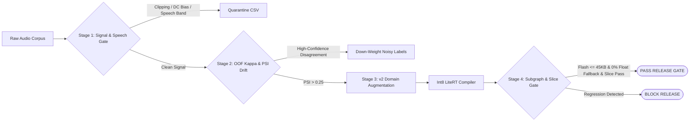

# PixelSense-Lite: Edge-Audio ML Data Pipeline & ARM64 `int8` Release Gate

[](https://github.com/coryjacoblewis/pixelsense-lite/actions/workflows/arm64_ml_release_gate.yml)
[](https://netron.app/?url=https://raw.githubusercontent.com/coryjacoblewis/pixelsense-lite/main/models/v2_data_flywheel/model_int8.tflite)
[](./models/v2_data_flywheel/model_int8.tflite)
[](./docs/model_and_data_cards.md)

## 1. Architecture & Overview

**PixelSense-Lite** is a 5-stage data and `.tflite` release pipeline for always-on environmental audio classification (`coughing`, `snoring`, `siren`, `crying_baby` vs. domestic `background_noise`) on low-power DSP cores, built on a 320-clip subset of [ESC-50](https://github.com/karolpiczak/ESC-50):



---

## 2. Release Gate Scorecard (`v1_baseline` vs. `v2_data_flywheel`)

- **`v1_baseline` (`BLOCKED`)**: Trained on clean `Folds 1-4` clips (`w = 1.0`).
- **`v2_data_flywheel` (`SHIP / PASS`)**: Triggered by Stage 2 drift (`PSI > 0.25`); down-weights disputed labels (`w = 0.35`) and augments `Folds 1-4` with disjoint Butterworth low-pass filters (`1,350 Hz`, `2,100 Hz`) and appliance noise (`+2.0 dB`, `+5.5 dB` SNR).

*Generated by [`04_release_gate.py`](./04_release_gate.py) -> [`reports/04_release_gate_scorecard.md`](./reports/04_release_gate_scorecard.md):*

| Release Candidate | Quant | Flash (`<=45 KB`) | Tensor Arena (`<=160 KB`) | INT8 Compliance (`100%`) | p99 Latency (`ms`) | 24h Battery (`<=0.05%`) | Clean F1 (`>=65%`) | Pocket F1 (`>=58%`) | +3dB Noise F1 (`>=52%`) | BG FPR (`<=15%`) | Release Gate Decision |
| :--- | :---: | :---: | :---: | :---: | :---: | :---: | :---: | :---: | :---: | :---: | :--- |
| `v1_baseline` | `fp32` | `64.08 KB` | `587.94 KB` | `0.0%` | `0.316 ms` | `0.322%` | `83.99%` | `45.91%` | `38.24%` | `37.50%` | `BLOCKED (HW + SLICE)` |
| `v1_baseline` | `fp16` | `36.04 KB` | `617.76 KB` | `0.0%` | `0.313 ms` | `0.322%` | `83.99%` | `45.91%` | `38.24%` | `37.50%` | `BLOCKED (HW + SLICE)` |
| `v1_baseline` | `int8` | `22.98 KB` | `147.33 KB` | `100.0%` | `0.115 ms` | `0.001%` | `83.99%` | `45.91%` | `38.24%` | `37.50%` | `BLOCKED (SLICE F1)` |
| `v2_data_flywheel` | `fp32` | `64.08 KB` | `587.94 KB` | `0.0%` | `0.355 ms` | `0.323%` | `90.50%` | `90.50%` | `77.41%` | `12.50%` | `BLOCKED (HW/BATTERY)` |
| `v2_data_flywheel` | `fp16` | `36.04 KB` | `617.76 KB` | `0.0%` | `0.312 ms` | `0.322%` | `90.50%` | `90.50%` | `77.41%` | `12.50%` | `BLOCKED (HW/BATTERY)` |
| **`v2_data_flywheel`** | **`int8`** | **`22.98 KB`** | **`147.33 KB`** | **`100.0%`** | **`0.104 ms`** | **`0.001%`** | **`90.50%`** | **`90.50%`** | **`75.28%`** | **`12.50%`** | **`SHIP (PASS)`** |

### 2.1 Confounder Ablation & Blind-Window Verification (`python 03_train_quantize.py --run-ablations`)

| Controlled Ablation (`Folds 1-4` -> Held-Out `Fold 5`) | Train Views | Epochs / Steps | Adjudication Weight | Clean F1 (`>=65%`) | Pocket F1 (`>=58%`) | +3dB Noise F1 (`>=52%`) |
| :--- | :---: | :---: | :---: | :---: | :---: | :---: |
| 1. `v1_baseline` (Clean Only) | `181` | `65` (`780` steps) | Uniform (`1.00`) | `83.99%` | `45.91%` | `38.24%` |
| 2. Step-Matched Clean (5x Epochs, No Augmentation) | `181` | `325` (`3,900` steps) | Uniform (`1.00`) | `81.97%` | `69.48%` | `26.77%` |
| 3. `v2` Augmentation Only (No Confident Learning Weight) | `905` | `65` (`3,705` steps) | Uniform (`1.00`) | `82.03%` | `83.21%` | `77.27%` |
| 4. Full `v2_data_flywheel` (`FP32` / `INT8` Production) | `905` | `65` (`3,705` steps) | `0.35` on 4 disputed | `90.50%` | `90.50%` | `77.41%` / `75.28%` |

- **Blind-Window Evaluation (`center_start=None`)**: Evaluating directly on peak-energy windows of the degraded waveforms yields `90.50%` Pocket F1 and `72.88%` `+3dB` Noise F1 (`int8`).

---

## 3. Pipeline Telemetry by Stage

### Stage 1: Audio Corpus Ingestion & Signal QA ([`01_ingest_qa.py`](./01_ingest_qa.py) -> [`reports/01_vendor_data_qa_report.csv`](./reports/01_vendor_data_qa_report.csv))

| QA Gate Status | Audited Clips | % of Drop | Signal / Speech Defect Caught |
| :--- | :---: | :---: | :--- |
| `PASS` | **230** | **71.9%** | Clean signal advancing to Stage 2 |
| `QUARANTINE_ADC_PREAMP_CLIPPING` | **76** | **23.8%** | Normalized peak amplitude `>= 0.998` |
| `QUARANTINE_MIC_DC_OFFSET_BIAS` | **10** | **3.1%** | Mean signal drift `> 0.002` |
| `QUARANTINE_EXCESSIVE_DEAD_AIR` | **2** | **0.6%** | `< 12%` active 50ms frames above `-50 dBFS` |
| `QUARANTINE_POTENTIAL_SPEECH_PII` | **2** | **0.6%** | Non-vocal clips (`3-152020-C-36.wav`, `5-231551-A-36.wav`) with `> 62%` `300-3,400 Hz` energy & crest `> 2.35` |

### Stage 2A: Group-Isolated Out-of-Fold Teacher Consensus ([`02_consensus_drift.py`](./02_consensus_drift.py) -> [`reports/02_label_consensus_and_kappa_audit.csv`](./reports/02_label_consensus_and_kappa_audit.csv))

- **OOF Agreement:** `90.0%` (`207 / 230` clips) | **Cohen's Kappa:** `0.851` (SLA `>= 0.80`)

| Disputed Clip (`ESC-50`) | Fold (`src_file`) | Crowd Label | OOF Teacher (`Conf`) | Acoustic Root-Cause |
| :--- | :---: | :---: | :---: | :--- |
| `3-141240-B-44.wav` | Fold 3 (`141240`) | `background_noise` (`engine`) | `snoring` (`0.664`) | Low-RPM 2-stroke idle (`80-220 Hz` bursts) resembles snoring cadence |
| `3-51731-A-42.wav` | Fold 3 (`51731`) | `siren` | `background_noise` (`0.764`) | Distant siren masked by broadband wind/street rumble |
| `4-167077-A-20.wav` | Fold 4 (`167077`) | `crying_baby` | `coughing` (`0.712`) | Short glottal cough-cry bursts lack sustained harmonic pitch contours |
| `4-184235-A-28.wav` | Fold 4 (`184235`) | `snoring` | `background_noise` (`0.704`) | Low-amplitude nasal breathing dominated by HVAC noise floor |
| `5-216368-A-28.wav` | Fold 5 (`216368`) | `snoring` | `background_noise` (`0.708`) | Held-out clip (`Fold 5`, untouched in training) with tape hiss masking soft snore |

### Stage 2B: Population Stability Index (PSI) Spectral Drift ([`reports/02_psi_spectral_drift_audit.csv`](./reports/02_psi_spectral_drift_audit.csv))

| Held-Out Evaluation Slice (`Fold 5`) | Eval Clips | High-Freq Band PSI | Noise-Floor PSI | Composite PSI | Threshold | Action |
| :--- | :---: | :---: | :---: | :---: | :---: | :--- |
| `clean` (Reference Audio) | 49 | `0.0642` | `0.0539` | `0.0642` | `0.2500` | `STABLE` |
| `pocket_occluded` (`1,600 Hz` Butterworth LP) | 49 | `1.9688` | `0.3690` | `1.9688` | `0.2500` | `CRITICAL_DRIFT_TRIGGER_FLYWHEEL` |
| `appliance_noise_3db` (`+3 dB` Domestic Noise) | 49 | `0.7213` | `0.7961` | `0.7961` | `0.2500` | `CRITICAL_DRIFT_TRIGGER_FLYWHEEL` |

### Stage 5: Native ARM64 C++ Operator Telemetry ([`reports/05_arm64_op_profile_int8.csv`](./reports/05_arm64_op_profile_int8.csv), [`reports/05_arm64_hardware_telemetry_int8.txt`](./reports/05_arm64_hardware_telemetry_int8.txt))

| Subgraph Operator / Layer (`v2 INT8`) | Op Count | Raw ARM64 CPU (`--use_xnnpack=false`) | ARM64 XNNPACK Delegate (`--use_xnnpack=true`) | Delegate Speedup & Kernel Dispatch |
| :--- | :---: | :---: | :---: | :--- |
| `conv1` (`CONV_2D` 16x3x3) | 1 | `93.97 µs` (`31.4%`) | `72.00 µs` (`43.4%`) | `1.31x` (`Convolution NHWC, QC8 IGEMM`) |
| `pool1` (`MAX_POOL_2D` 2x2) | 1 | `11.00 µs` (`3.7%`) | `6.00 µs` (`3.6%`) | `1.83x` (`Max Pooling NHWC, S8`) |
| `conv2` (`CONV_2D` 32x3x3) | 1 | `80.08 µs` (`26.8%`) | `61.00 µs` (`36.7%`) | `1.31x` (`Convolution NHWC, QC8 IGEMM`) |
| `pool2` (`MAX_POOL_2D` 2x2) | 1 | `3.40 µs` (`1.1%`) | `2.00 µs` (`1.2%`) | `1.70x` (`Max Pooling NHWC, S8`) |
| `conv3` (`CONV_2D` 32x3x3) | 1 | `33.80 µs` (`11.3%`) | `25.00 µs` (`15.1%`) | `1.35x` (`Convolution NHWC, QC8 IGEMM`) |
| `gap` (`MEAN` GlobalAvgPool) | 1 | `75.87 µs` (`25.4%`) | `< 0.10 µs` (`0.0%`) | `>100x` (`Mean ND SIMD reduction`) |
| `fc1` + `probs` (`FULLY_CONNECTED` + `SOFTMAX`) | 3 | `0.78 µs` (`0.3%`) | `< 0.20 µs` (`0.1%`) | `~4.0x` (`Fully Connected NC, QS8, QC8W GEMM`) |
| **Total End-to-End Inference (`avg` / `p95`)** | **9 Nodes** | **`300.97 µs` / `310 µs`** | **`172.38 µs` / `177 µs`** | **`1.75x Faster` (`42.7%` latency reduction)** |

---

## 4. Quickstart

```bash
python3.11 -m venv .venv
source .venv/bin/activate
pip install -r requirements.txt

python run_automated_pipeline.py   # End-to-end pipeline (Stages 1-5)
pytest 05_verify_pipeline.py       # Invariant test suite
```
